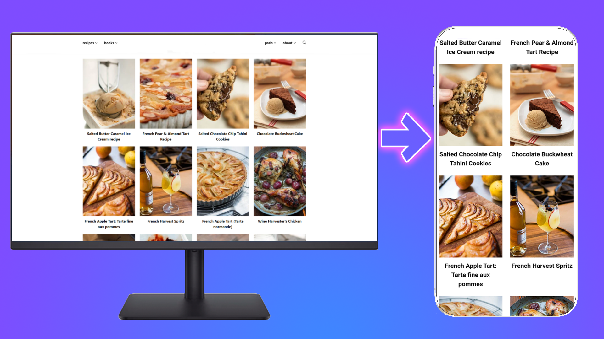

\# Website → Android App (APK)

Turn any website into a simple Android application in minutes.

No Android Studio.  

No coding.  

Just a Telegram bot.

---

\## 🚀 What is this?

This project provides a \*\*Telegram bot\*\* that converts any website

into an Android \*\*WebView-based APK\*\*.

Perfect for:

\- Small businesses

\- Landing pages

\- MVPs

\- Online services

\- Personal websites

---

\## ⚙️ How it works

1\. Send your website URL to the Telegram bot

2\. Get a demo Android APK

3\. Customize app name \& icon

4\. Verify site ownership

5\. Get the full version

Website → APK → Done.

---

\## ✨ Features

\- 🌐 Website to Android APK (WebView)

\- 🆓 Free demo version

\- 🔐 Website ownership verification

\- 🎨 Custom app name \& icon

\- 💳 Telegram Stars payments

\- 👥 Multi-user support

---

\## ❓ Why use this instead of Android Studio?

\- No Android development skills required

\- No setup or configuration

\- Takes minutes, not days

\- Ideal for non-technical founders

---

\## 📲 Try it

👉 \*\*Use the Telegram bot:\*\*  

👉 [@YourBotName](https://t.me/SiteWrapper_bot)

[Visit website](https://android123123.github.io/appmaker/)

(Free demo available)

---

\## 📌 Use cases

\- Convert a business website into an Android app

\- Create a quick mobile app for clients

\- Validate an idea before full development

\- Offer app versions to existing users

---

\## ⚠️ Notes

\- This is a WebView-based application

\- Not intended for complex native apps

\- Best suited for content-driven websites

